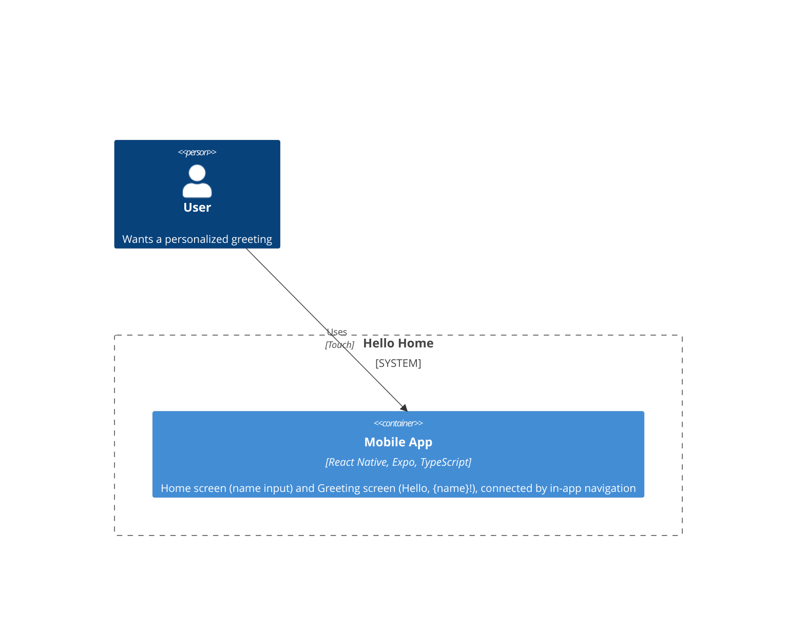

# C4 Container — Hello Home

## Containers

- **Mobile App** — the entire product for this feature. A single Expo/React
  Native/TypeScript client with two screens (Home, Greeting) connected via
  in-app stack navigation (see
  [ADR-0001](adr-0001-expo-router-navigation.md)). State (the entered name)
  is held in navigation route params / local component state and does not
  persist across app restarts.

## Departure From Default Stack

The default stack includes a Node.js/TypeScript/Fastify API and PostgreSQL
for persistent data. This feature has no data to persist and no need for a
backend: the greeting is computed entirely from user input already present
on-device. No API container, database, or identity provider (Clerk) is
included. If a future enhancement needs server-side state, accounts, or
data persistence, that will be introduced then with its own container(s).
