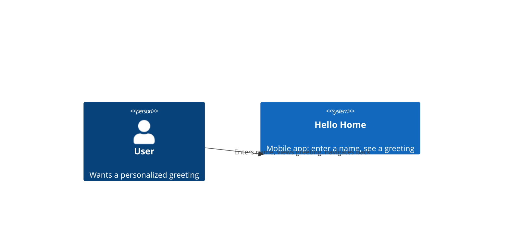

# C4 Context — Hello Home

## Relationships

- **User → Hello Home:** the only actor. The user types a name into the app
  and receives a greeting; no other person or role is involved.

## External Systems

None. This feature has no identity provider, payment processor, backend
API, or third-party integration — it is a fully self-contained client app.
No external system is included in this diagram because none is relevant.
