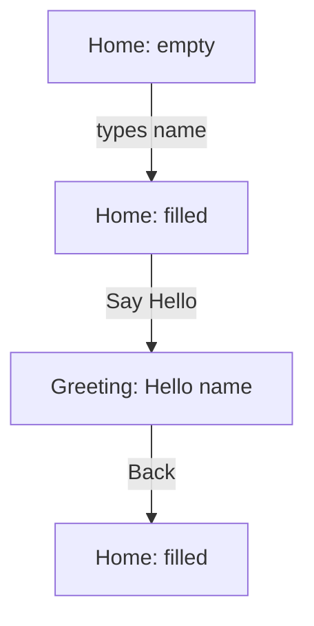

# User Flow — Hello Home

## Happy Path

**Goal achieved:** the user sees a personalized greeting for the name they
entered, and can return to try again.

## Alternate / Edge Paths

- **Empty or whitespace-only name:** "Say Hello" stays disabled; user cannot
  proceed to the Greeting screen until valid input is entered (AC-2).
- **Name with leading/trailing spaces:** trimmed before display, so
  "  Ava  " → "Hello, Ava!" (AC-3).
- **Back navigation preserves input:** returning from Greeting to Home shows
  the same name that was submitted, so the user isn't forced to retype
  (AC-5).

## Error / Empty States

- There is no network or backend call, so there are no loading or
  network-error states.
- The only "empty state" is the initial Home screen with an empty name
  field, handled by the disabled-submit rule above.
